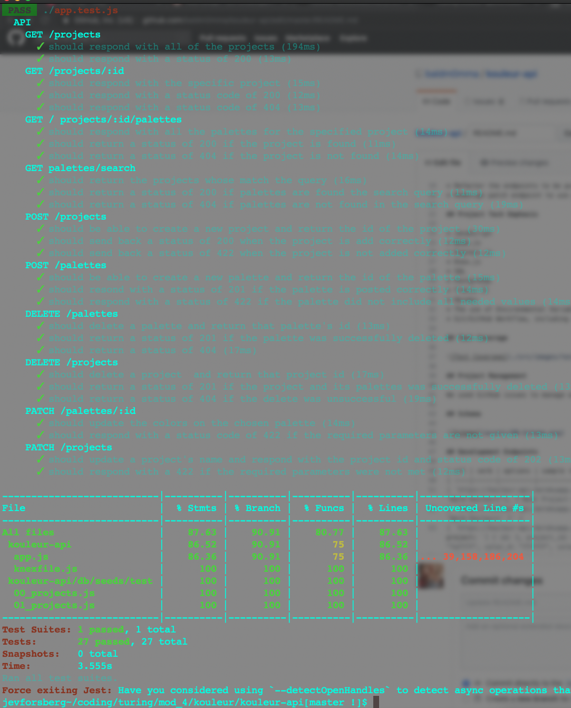
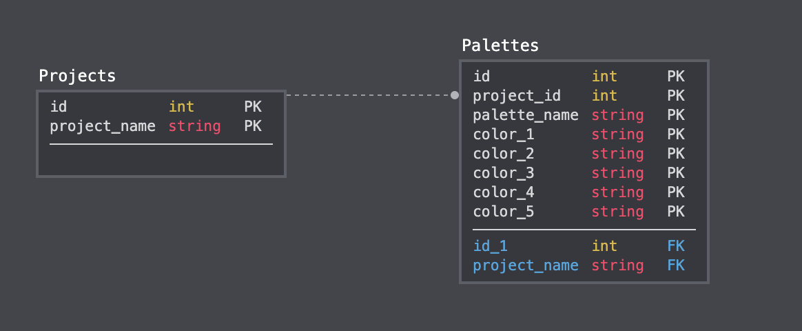

# Kouleur - The Color Palette Picker Assistant

## Description

This project is a RESTful API color palette picker that utilizes semantic HTTP methods, intuitive url pathway naming conventions, and a one-to-many postgreSQL database of our own design. A user can GET the following: all projects, all palettes, a single projct, a single palette, and search a single palette by hexadecimal color query; they can POST the following: a single project and a single palette; and they can DELETE the following: a single project and a single palette; as well as they can PATCH a single palette.

This project also pairs with a React/Redux Front End App in which we used Semantic UI elements to style and design an elegant, thoughtful, and intuitive UI/UX experience. You can find our code for it [here](https://github.com/baldm0mma/kouleur-fe), and our deployed front end site [here](https://kouleur.herokuapp.com/) on Heroku.

## Project Successes

THE FULL-STACK WORKFLOW: This is the API that is consumed by a front-end app also of our creation. It was a fantastic learning experience to design, create, and control everything from the PostgreSQL database to the design, function, and styling of the UI/UX.

POSTGRESQL DATABASE - Learning first has how to design, execute, and populate a database was incrediblby informative. Seeing how the HTTP request/response cycle functions as the bridge between the FE and the BE was a very important learning experience, and will no doubt continue to inform how we develop both the FE and BE as full-stack software engineers.

## Project Challenges

KNEX - This was our second time creating a database from scratch; so the learning curve was steep. However, fortunely, fairly quickly the concepts sunk in, and the actual schema design, migrations, and data-seeding become fairly intuitive. We used Knex.js for the SQL querying, however, on a number of endpoints, we actually found that writing directly in SQL, and  using the knex.raw() method was not only less verbose, but had much better, and more reliable outcomes. While Knex.js was a good learning experience, it felt like an unnecessary abstractive layer on top of an already fairly easily readable/writable/learnable SQL experience.

## Project Extensions/Issues

* Refactor the endpoints to be pure SQL.
* Redesign patch endpoint to use put method.

## Project Tech Emphasis

* JavaScript
* Node.js
* Express.js
* Knex.js
* SQL
* PostgreSQL
* Travis CI
* Heroku
* The use of Environmental Variables for Development/Test/CI/ and Production.
* Git/GitHub Workflow, including rebasing.

## Project Management

We used GitHub issues to manage workflow.

## Test Coverage

The only lines untested were 500 status errors, which are difficult to simulate and often a sign of a larger database issue.

## Schema

## Development Endpoints

| url | verb | options | sample response |
| ----|------|---------|---------------- |
| `https://kouleur-api.herokuapp.com/api/v1/projects` | GET | Not Needed | An array of all projects: `[ { id: 1, project_name: 'Warm Kouleurs'}, { Next Project Object } ]` |
| `https://kouleur-api.herokuapp.com//api/v1/projects/:id` | GET | An `id` param | A single project: `{ id: 1, project_name: 'Warm Kouleurs' }` |
| `https://kouleur-api.herokuapp.com/api/v1/projects/:id/palettes` | GET | An `id` param | All the palettes for a specific project: `[ { id: 1, project_id: 1, palette_name: "Summertime Breeze", color_1: "91a6ff", color_2: "ff88dc", color_3: "faff7f", color_4: "ffffff", color_5: "ff5154" }, { Next Palette Object} ]` |
| `https://kouleur-api.herokuapp.com/api/v1/palettes/search` | GET | `Query: "ff88dc"` | Search for and return a specific Palette that contains the hexadecimal query as a color value: `{ id: 1, project_id: 1, palette_name: "Summertime Breeze", color_1: "91a6ff", color_2: "ff88dc", color_3: "faff7f", color_4: "ffffff", color_5: "ff5154" }` |
| `https://kouleur-api.herokuapp.com/api/v1/projects` | POST | { project: { project_name: `STRING` } } | Returns the id of the newly made Project: `{ id: 11 }` |
| `https://kouleur-api.herokuapp.com/api/v1/palettes` | POST | { palette: { project_id: `NUMBER`, palette_name: `STRING`, color_1: `STRING`, color_2: `STRING`, color_3: `STRING`, color_4: `STRING`, color_5: `STRING` } } | The new palette's id: `{ id: 12 }` |
| `https://kouleur-api.herokuapp.com/api/v1/palettes/:id` | DELETE | An `id` param | The deleted Palette's id: `{ id: 13 }` |
| `https://kouleur-api.herokuapp.com/api/v1/projects/:id` | DELETE | An `id` param | The deleted Projects's id: `{ id: 14 }` |
| `https://kouleur-api.herokuapp.com/api/v1/palettes/:id` | PATCH | An `id` param + `{ palette_name: "Summertime Breeze", color_1: "aaaaaa", color_2: "bbbbbb", color_3: "cccccc", color_4: "ffffff", color_5: "eeeeee" }` | The patched Palette's id: `{ id: 14 }` |

Authors: [Jev Forsberg](https://github.com/baldm0mma/); [Evan Markowitz](https://github.com/evanmarkowitz)
